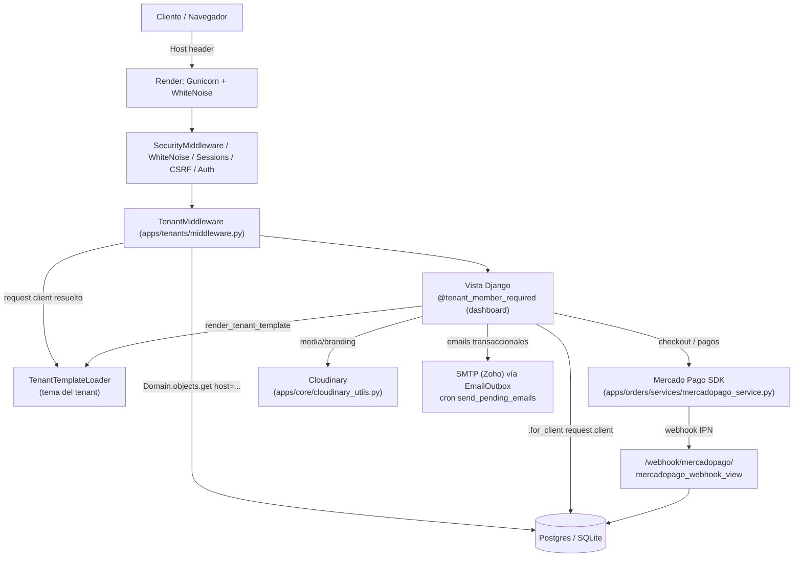

# Arquitectura del Sistema — AndesScale SaaS

> Manual de arquitectura técnica y onboarding, basado en el código real del repositorio a la fecha de este documento. Cada afirmación cita archivo, clase o función existente. Las notas marcadas como **⚠️ Hallazgo** son observaciones de calidad/consistencia encontradas durante el análisis — no implican que algo esté roto en producción, y no fueron corregidas en este documento (el alcance era documentar, no refactorizar).

## Índice

1. [Visión general y arquitectura del SaaS](#1-visión-general-y-arquitectura-del-saas)
2. [Desglose módulo por módulo](#2-desglose-módulo-por-módulo)
3. [Integraciones externas y servicios](#3-integraciones-externas-y-servicios)
4. [Entorno local (SQLite) vs. producción (Postgres)](#4-entorno-local-sqlite-vs-producción-postgres)
5. [Guía práctica: ¿qué archivos debo tocar?](#5-guía-práctica-qué-archivos-debo-tocar)
6. [Convenciones y anotaciones técnicas](#6-convenciones-y-anotaciones-técnicas)

---

## 1. Visión general y arquitectura del SaaS

### 1.1 Qué es

Un único despliegue Django 5.2 sirve **múltiples sitios de clientes** (tenants): cada dominio HTTP entrante se resuelve a un `Client` distinto, con su propio tema visual, contenido (`Section`, `Service`, galería), branding y configuración de contacto/email. El mismo código y la misma base de datos atienden a todos los tenants — no hay bases de datos ni esquemas separados por cliente.

El negocio en sí tiene dos caras:
- **Cara pública**: cada tenant tiene una landing page (`apps/website/views.py::home`) y un dashboard de administración de contenido (`apps/website/views.py::dashboard*`) accesible solo a usuarios de ese tenant.
- **Cara de ventas**: un flujo de checkout con Mercado Pago (`apps/orders/`) que cobra, provisiona un `Client` nuevo (onboarding automático) y lo deja listo para operar — este es el "auto-signup" de nuevos tenants.

### 1.2 Apps Django como bloques funcionales

| App | Responsabilidad |
|---|---|
| `apps.tenants` | Núcleo multitenant: modelos `Client`/`Domain`/`ClientSettings`/`ClientEmailSettings`/`FormConfig`, `TenantMiddleware`, `TenantAwareManager`, `TenantTemplateLoader`. |
| `apps.accounts` | Identidad y autorización: `UserProfile` (vincula `User` ↔ `Client`), decorador `tenant_member_required`, login/logout/reset de contraseña. |
| `apps.website` | CMS del tenant: landing pública, dashboard de contenido (secciones, servicios, galería, contactos, branding). |
| `apps.orders` | Checkout, integración Mercado Pago, provisioning de tenants nuevos (onboarding). |
| `apps.marketing` | SEO por tenant: `sitemap.xml`, `robots.txt`, verificación de Google/Bing, metadata (`SEOConfig`). |
| `apps.core` | Utilidades transversales: Cloudinary (`cloudinary_utils.py`), cola de emails asíncrona (`EmailOutbox`), rate limiting, resolución de templates (`render_tenant_template`). |

### 1.3 Estrategia multitenant

La multitenencia se implementa **por resolución de dominio + filtrado explícito por Foreign Key**, no por schema-per-tenant ni por Row-Level Security de Postgres.

- **Resolución del tenant** — `apps/tenants/middleware.py::TenantMiddleware` (último en `MIDDLEWARE`, después de `AuthenticationMiddleware`):
  1. Lee `request.get_host()` y busca un `Domain` activo con ese hostname (`Domain.objects.select_related('client').get(domain=host, is_active=True, client__is_active=True)`).
  2. En `DEBUG`, admite override por querystring `?tenant=<slug>` contra `Client.objects.filter(slug=..., is_active=True)`.
  3. Si el host coincide con un dominio de sistema (`SYSTEM_DOMAINS`: `localhost`, `127.0.0.1`, `settings.BASE_DOMAIN`, `settings.RENDER_EXTERNAL_HOSTNAME`, o cualquier `*.onrender.com`), setea `request.client = None` y deja pasar sin bloquear (es el dominio de administración/sistema, no un tenant real).
  4. Si el host no coincide con ningún dominio conocido, corta la request con un 404 inline — **esto reemplaza en la práctica a `ALLOWED_HOSTS`**, que por eso está seteado a `['*']` en `base.py` (el propio middleware lo documenta: "Actúa como reemplazo dinámico de ALLOWED_HOSTS").
  - Además de `request.client`, guarda el tenant en un thread-local (`set_current_tenant()`/`get_current_tenant()`) que usa `TenantTemplateLoader` para resolver templates sin tener que pasar `request` explícitamente al motor de templates.
- **Resolución de tema/template** — `apps/tenants/template_loader.py::TenantTemplateLoader`: dado un `template_name`, prueba `templates/{tema_del_tenant}/{name}` → `templates/default/{name}` → `templates/{name}` (fallback global para `base.html`, componentes compartidos). Las vistas nunca arman esta ruta a mano: usan `apps.core.template_resolver.render_tenant_template(request, template_path, context)`.
- **Aislamiento de datos** — `apps/tenants/managers.py::TenantAwareManager` **no filtra automáticamente por tenant**. Su auto-filtro basado en un atributo de clase (`_current_client`) se eliminó deliberadamente (ver `#MED-02` en el historial del proyecto) porque nunca se seteaba en código de request real y era un riesgo de fuga de datos entre tenants concurrentes (atributo de clase compartido entre requests). El contrato actual es: **toda vista debe filtrar explícitamente** con `.for_client(client)` o `.filter(client=request.client)`. Esto se verifica con un test dedicado: `apps/tenants/tests_isolation.py`.
- **Autorización cross-tenant** — `apps/accounts/decorators.py::tenant_member_required` exige que `request.user.profile.client_id == request.client.id` (o `is_superuser`); un `@login_required` solo no alcanza, porque no impide que un usuario autenticado de un tenant navegue al dashboard de otro tenant con el mismo login activo (fix documentado como `#AUD-03`).
- **Cookies aisladas por tenant** — en producción, `CSRF_COOKIE_DOMAIN = None` y `SESSION_COOKIE_DOMAIN = None` son explícitos, con un comentario en `production.py` advirtiendo que **nunca** se debe setear un dominio compartido tipo `.andesscale.cl`, porque eso filtraría sesión/CSRF entre tenants distintos.

### 1.4 Diagrama conceptual del flujo



No hay evidencia en el repo de Cloudflare delante de Render (sin headers `CF-*`, sin config de proxy adicional) — el único proxy reconocido es el de Render (`SECURE_PROXY_SSL_HEADER = ('HTTP_X_FORWARDED_PROTO', 'https')`).

---

## 2. Desglose módulo por módulo

### 2.1 Configuración global

- **`config/settings/__init__.py`** — switch de entorno:
  ```python
  from .base import *
  env = os.environ.get('DJANGO_ENVIRONMENT', 'development')
  if env == 'production':
      from .production import *
  else:
      from .development import *
  ```
  `DJANGO_SETTINGS_MODULE` apunta siempre a `config.settings` (ver `manage.py`, `wsgi.py`, `asgi.py`); es la variable `DJANGO_ENVIRONMENT` la que decide dev vs prod.
  **⚠️ Hallazgo**: `render.yaml` en realidad setea `DJANGO_SETTINGS_MODULE=config.settings.production` directamente, saltándose este switch de `__init__.py` y apuntando derecho a `production.py`. Ambos caminos llegan al mismo resultado en producción, pero conviene saber que conviven dos mecanismos de selección de settings.

- **`config/settings/base.py`** — compartido por ambos entornos:
  - `SECRET_KEY = config('SECRET_KEY')` (via `python-decouple`, sin default → falla si falta).
  - `INSTALLED_APPS`: apps de Django + `django_extensions`, luego `apps.core`, `apps.tenants`, `apps.website`, `apps.accounts`, `cloudinary`, `cloudinary_storage`, `apps.orders`, `apps.marketing`.
  - `MIDDLEWARE`, en orden: `SecurityMiddleware` → `WhiteNoiseMiddleware` → `SessionMiddleware` → `CommonMiddleware` → `CsrfViewMiddleware` → `AuthenticationMiddleware` → `MessageMiddleware` → `XFrameOptionsMiddleware` → **`apps.tenants.middleware.TenantMiddleware`** (deliberadamente último).
  - `TEMPLATES`: `APP_DIRS: False` (obligatorio porque se usan loaders custom), `DIRS: [BASE_DIR/'templates']`, `context_processors` incluye `apps.tenants.context_processors.client_context` (inyecta `client` y `current_year` en todo template). Loaders en orden: `TenantTemplateLoader` → `filesystem.Loader` (global) → `app_directories.Loader` (para `admin/login.html`, etc).
  - `DATABASES`: `dj_database_url.config(default=f'sqlite:///{BASE_DIR}/db.sqlite3', conn_max_age=600)` (ver sección 4).
  - Static/media: `STATICFILES_STORAGE = 'whitenoise.storage.CompressedManifestStaticFilesStorage'`, `DEFAULT_FILE_STORAGE = 'cloudinary_storage.storage.MediaCloudinaryStorage'`.
  - Sesión: cookie custom `saasmvp_sessionid`, `SESSION_COOKIE_AGE=7200`.
  - `LOGIN_URL='/superadmin/login/'`.

- **`config/settings/development.py`** — fuerza SQLite, `EMAIL_BACKEND` de consola, `ALLOWED_HOSTS=['*']`, `DEBUG=True`.

- **`config/settings/production.py`** — patrón *fail-fast* (falla al **importar**, no al recibir un request):
  - `if not SECRET_KEY: raise ValueError(...)`.
  - `if not EMAIL_HOST_USER or not EMAIL_HOST_PASSWORD: raise ValueError(...)` — evita que un fallback silencioso a consola descarte emails transaccionales (pago, onboarding) sin que nadie lo note.
  - Construye `ALLOWED_HOSTS`/`CSRF_TRUSTED_ORIGINS` desde `BASE_DOMAIN` + `TENANT_DOMAINS` + `EXTRA_DOMAINS` (env vars), expandiendo automáticamente variantes con/sin `www.` (`_with_www_variants()`), documentado como fuente única de verdad para que ambas listas nunca diverjan.
  - Inserta `CSPMiddleware` + `PermissionsPolicyMiddleware` después de `XFrameOptionsMiddleware`, importando los dicts desde `config/settings/security_headers.py`.
  - `DEBUG = False` hardcodeado al final, sin override por env var (a propósito).

- **`config/settings/security_headers.py`** — separado de `production.py` específicamente para poder testear el dict de CSP sin disparar los `raise` de `production.py`. Define `CONTENT_SECURITY_POLICY` (excluye `/checkout/` del CSP porque los dominios del iframe de Mercado Pago Checkout Bricks no están documentados de forma confiable; `unsafe-inline` en script/style porque los temas usan `<style>` inline con variables CSS por tenant) y `PERMISSIONS_POLICY` (bloquea cámara/micrófono/geolocalización/etc., deja `payment`/`autoplay`/`fullscreen` sin restringir por Mercado Pago y video de fondo).

- **`config/settings/cloudinary_settings.py`** — **⚠️ Hallazgo: código muerto**. Su docstring dice "Importar en base.py: `from .cloudinary_settings import *`", pero ningún archivo de `config/` ni `apps/` lo importa. `base.py` duplica la misma configuración de Cloudinary inline en su lugar (con un `CLOUDINARY_PRESETS` distinto y más chico que el de `apps/core/cloudinary_utils.py`, que es el que realmente se usa en runtime). No afecta el funcionamiento actual, pero es deuda técnica a limpiar.

- **`config/urls.py`** (`ROOT_URLCONF`) — orden de `include()` (importa porque Django resuelve en orden y algunos includes no tienen namespace):
  1. `apps.tenants.urls` (sin namespace) — primero, para que `/superadmin/nuevo/` no choque con el admin de Django.
  2. `superadmin/` → `admin.site.urls` — **el admin de Django vive en `/superadmin/`, no en `/admin/`**, a propósito, para no chocar con rutas de tenant.
  3. `auth/` → `apps.website.auth_urls` (sin namespace).
  4. `apps.marketing.urls` (namespace `marketing`).
  5. `apps.website.urls` (sin namespace) — catch-all, deliberadamente al final.
  6. `checkout/` → `apps.orders.urls` (namespace `orders`).
  7. `webhook/` → `apps.orders.urls_webhooks` (sin namespace, endpoints públicos).
  8. `onboarding/` → `apps.orders.urls_onboarding` (sin namespace).
  9. `auth/` → `apps.accounts.urls` (namespace `accounts`).

  **⚠️ Hallazgo**: los pasos 3 y 9 montan distintos `include()` en el mismo prefijo `auth/`. Como el paso 3 (`apps.website.auth_urls`, sin namespace) se resuelve primero y también define `login/`/`logout/`, las vistas `apps.accounts.views.login_view`/`logout_view` quedan efectivamente inalcanzables en `/auth/login/`/`/auth/logout/` — esas rutas siempre resuelven a `apps.website.auth_views.client_login`/`client_logout`. Las demás rutas de `apps.accounts.urls` (`set-password/`, `forgot-password/`, `change-password/`) sí son alcanzables porque no colisionan.

- **Despliegue: WSGI, no ASGI** — `Procfile` y `render.yaml` usan `gunicorn config.wsgi:application`. `config/asgi.py` existe pero no se referencia en ningún lado del deploy — es código vestigial.

### 2.2 `apps.tenants` — núcleo multitenant

- **`models.py`**:
  - `Client`: `name`, `slug` (único, auto-slugify), `company_name`, `contact_email/phone`, `template` (`THEME_CHOICES`: `'themes/default'`, `'servelec'`, `'ranchocachimba'`), `plan`, `is_active`, `mode_under_construction`, `setup_completed`, `setup_fee_paid`, billing (`monthly_fee`, `last_payment_date`, `next_payment_due`), cuotas (`max_images`, `max_pages`, `max_services`). Propiedades `primary_domain`, `all_domains`.
  - `Domain`: FK `client` (`related_name='domains'`), `domain` (único, indexado), `domain_type` (`subdomain`/`custom`, auto-detectado comparando con `settings.BASE_DOMAIN`), `is_primary` (el `save()` promueve automáticamente el primer dominio de un cliente y demueve otros al marcar uno nuevo como primario), `is_verified`, `verification_token`.
  - `ClientSettings` (`OneToOneField(Client)`): branding vía `CloudinaryField` (`logo`, `logo_footer`, `favicon`), `primary_color`/`secondary_color`/`accent_color`, `font_family`, SEO básico, analytics, feature flags (`enable_blog`, `enable_testimonials`, `enable_gallery`, `show_default_hero`), límites de galería/hero, `digest_enabled`/`digest_frequency`, `auto_purge_enabled`.
  - `ClientEmailSettings` (`OneToOneField(Client)`): proveedor de email por tenant (`none`/`smtp`/`sendgrid`/`resend`/`mailgun`/`ses`), `notify_emails`, `test_mode`, helpers `get_notify_emails_list()`, `can_send_email()`.
  - `FormConfig` (`OneToOneField(Client)`): toggles/labels del formulario de contacto por tenant.
- **`middleware.py::TenantMiddleware`** — ver §1.3.
- **`managers.py::TenantAwareManager`** — sin auto-filtro (ver §1.3); API: `for_client(client)`, `active()`, `featured()`, `ordered()`.
- **`template_loader.py::TenantTemplateLoader`** — ver §1.3.
- **`context_processors.py::client_context`** — inyecta `client` y `current_year` en todo template.

### 2.3 `apps.accounts` — identidad y autorización

- **`models.py::UserProfile`** (`OneToOneField(User, related_name='profile')`): `client` (FK a `tenants.Client`, `null=True` solo para superusers por convención, no forzado a nivel DB), `role` (`owner`/`admin`/`editor`/`viewer`), `invitation_token` (UUID único), `invitation_expires_at`, `invited_at`. Propiedades `is_owner`, `is_admin`, `can_edit`.
  - Se crea por **signal**, no a mano: `post_save` de `User` → `create_or_update_user_profile` hace `UserProfile.objects.get_or_create(user=instance)`. Un `UserProfile.objects.create(...)` posterior choca con el `OneToOneField` (`IntegrityError`) — usar `update_or_create`.
  - **⚠️ Hallazgo**: `apps/accounts/views.py` llama a `profile.is_invitation_valid()`, `profile.generate_invitation_token(days=1)`, `profile.clear_invitation()` y lee/escribe `user.profile.last_login_at` — ninguno de estos métodos/campos existe en `UserProfile` (`models.py`). Son rutas potencialmente rotas (`AttributeError` si se ejercitan) en el flujo de reset de contraseña/login custom de esta app — que además, por el hallazgo de §2.1, no es el que responde en `/auth/login/`.
- **`decorators.py::tenant_member_required`** — ver §1.3.
- **`mixins.py`**: `TenantAdminMixin` (filtra querysets/FKs del Django Admin por `request.user.profile.client`), `TenantAdminReadOnlyMixin` (restringe permisos por rol).
- **`urls.py`** (namespace `accounts`): `login/`, `logout/`, `set-password/<uuid:token>/`, `forgot-password/`, `change-password/`.

### 2.4 `apps.website` — CMS del tenant (landing + dashboard)

- **`models.py`**:
  - `Section` (`objects = TenantAwareManager()`): `client` FK, `section_type` (hero/about/service/contact/gallery), `image`/`background_image` (`CloudinaryField`), `order`, `is_active`, `slot_key`. `unique_together = ('client', 'section_type')`.
  - `Service` (`TenantAwareManager`): `client` FK, `name`, `slug` (auto, único por cliente), `image` (`CloudinaryField`), `price_text`, `is_featured`.
  - `ContactSubmission` (`TenantAwareManager`): `client` FK, datos del lead, `status` (new/read/replied/spam), `is_spam` (honeypot), `ip_address`/`user_agent`.
  - `GalleryItem` (`TenantAwareManager`): `client` FK, `gallery_type` (hero/gallery), `image` (`CloudinaryField`), `cta_text`/`cta_url`.
- **`views.py`**: vistas públicas (`home` — usa `render_tenant_template(request, 'landing/home.html', ...)`; `contact_submit` — usa `RateLimiter`, honeypot vía `ContactForm`) y vistas de dashboard, todas con `@tenant_member_required`: `dashboard`, `dashboard_sections`/`edit_section_dashboard`, `dashboard_services`/`create_service_dashboard`/`edit_service_dashboard`/`reorder_services`, `dashboard_contacts`/`mark_contact_read`/`mark_contact_replied`, `dashboard_gallery`/`gallery_item_*` (gateado por `ClientSettings.enable_gallery` y límites de imágenes), `dashboard_branding`.
  - Nota: varias vistas de dashboard llaman directo a `cloudinary.uploader.upload/destroy` en vez de pasar por `apps.core.cloudinary_utils` — inconsistencia menor de capa, no un bug.
- **`auth_views.py`** (separado de `apps.accounts`): `client_login`/`client_logout` — login custom que valida pertenencia al tenant (`_user_belongs_to_tenant()`, mismo fix `#AUD-03`). Es el que realmente responde en `/auth/login/` (ver hallazgo §2.1).
- **`urls.py`** (sin `app_name`): rutas de landing, dashboard y HTMX inline-editing.
- **`forms.py`**: `SectionForm`, `ServiceForm`, `ContactForm` (honeypot `website`, `get_subject_by_intent()`), `GalleryItemForm`.
- Sin `signals.py` propio: el borrado en cascada de assets Cloudinary de `Section`/`Service`/`GalleryItem` lo maneja `apps/core/signals_cloudinary.py` de forma centralizada.

### 2.5 `apps.orders` — checkout, Mercado Pago, onboarding

Ver detalle completo de Mercado Pago en §3.1. Resumen de modelos:

- `Plan`: `name`, `slug`, `price`/`renewal_price` (CLP), `features` (JSON), `available_themes` (JSON), cuotas (`max_pages`, `max_services`, `max_images`, `max_storage_mb`), feature flags (`has_custom_domain`, `has_analytics`, `has_white_label`).
- `Order`: `uuid` (PK), `order_number` (`ORD-{año}-{uuid.hex[:6]}`, derivado del UUID para evitar condiciones de carrera entre creaciones concurrentes — no un `count()+1`), `plan` FK, `client` FK (`SET_NULL`, se completa recién al terminar el onboarding), datos de facturación (para futura facturación SII chilena), `status` (pending/processing/paid/onboarding/completed/failed/cancelled/refunded/expired), campos de Mercado Pago (`mp_payment_id` indexado, `mp_status`, `mp_response_data` JSON con la respuesta cruda para auditoría), `onboarding_token` (UUID único), métodos `mark_as_paid()`, `mark_as_failed()`, `mark_as_completed()`, `is_token_valid()`.
- `PaymentLog`: auditoría de cada evento de pago (`order` FK, `action`, `raw_data` JSON).
- **`signals.py`** (`OrdersConfig.ready()`): `pre_save` en `Order` → `log_order_status_change` (loguea la transición y, si el nuevo estado es `paid`/`failed`/`refunded`, **también** crea un `PaymentLog` — camino independiente de los que crean `PaymentLog` explícitamente en `views.py`/`order_processor.py`).
  - **⚠️ Hallazgo**: esto es un segundo camino de escritura de `PaymentLog` para los mismos eventos que ya loguean `views.py`/`views_onboarding.py` — riesgo de duplicación de registros de auditoría, no de datos de negocio.
- **`services/order_processor.py::OrderProcessor`** — **⚠️ Hallazgo**: parece una capa de orquestación alternativa (`create_order`, `process_successful_payment`, `complete_onboarding`) que el flujo real (`views.py`/`views_onboarding.py`) no usa — construyen `Order`/`PaymentLog` inline en su lugar. Sus `# TODO` de envío de email ya están resueltos, pero en otro archivo. Candidata a limpieza futura, no tocada acá.

### 2.6 `apps.marketing` — SEO por tenant

- **`models.py::SEOConfig`**: `unique_together = ('client', 'page_key')`; `title`/`meta_description`/`meta_keywords`, `robots`, `canonical_url`, `og_image` (`CloudinaryField`), `schema_type` (LocalBusiness/Organization/Service/Electrician/GeneralContractor/Plumber…), `schema_json`. Método `get_schema_json()` arma JSON-LD dinámicamente desde `client`/`client.settings`/dominio primario.
- **`views_sitemap.py`**, **`sitemaps.py`** (`TenantStaticSitemap`, `TenantSectionsSitemap`), **`views_robots.py`** (`robots.txt` por tenant, con `Disallow` de `/dashboard/`, `/superadmin/`, `/auth/`, `/checkout/`, `/onboarding/`, `/webhook/`), **`views_verification.py`** (archivo de verificación de Google Search Console).
- **`urls.py`** (namespace `marketing`): `sitemap.xml`, `sitemap-<section>.xml`, `robots.txt`, verificación de Google.

### 2.7 `apps.core` — utilidades transversales

- **`models.py`**: `BaseModel` (abstracto, `created_at`/`updated_at`); `EmailOutbox` — cola de emails asíncrona (`status` pending/sent/failed, `attempts`, `max_attempts`), drenada por el comando `send_pending_emails` (cron cada 5 min en `render.yaml`).
- **`cloudinary_utils.py`** — ver §3.2.
- **`signals_cloudinary.py::register_cloudinary_signals()`** — conecta `post_delete` en `ClientSettings`, `Section`, `Service`, `GalleryItem`, `SEOConfig` para borrar el asset de Cloudinary correspondiente; se llama una vez desde `apps/core/apps.py::CoreConfig.ready()`.
- **`template_resolver.py::render_tenant_template`** — ver §1.3.
- **`rate_limit.py::RateLimiter`** — rate limiting basado en cache, clave `rl:{scope}:{tenant_id}:{ip}`; usado por `contact_submit`.
- **`management/commands/`**: `send_pending_emails`, `check_cloudinary`, `cloudinary_usage`, `audit_cloudinary_assets`.

### 2.8 Modelo de datos y aislamiento (ER simplificado)

```
Client 1─N Domain
Client 1─1 ClientSettings
Client 1─1 ClientEmailSettings
Client 1─1 FormConfig
Client 1─N Section / Service / GalleryItem / ContactSubmission
Client 1─N Order (SET_NULL — se asigna recién al completar onboarding)
Client 1─N SEOConfig (unique_together client+page_key)
User    1─1 UserProfile N─1 Client (null solo para superusers)
Order   1─N PaymentLog
Order   N─1 Plan
```

El aislamiento entre tenants es por **convención de filtrado explícito por `client` FK**, verificado con tests dedicados (`apps/tenants/tests_isolation.py`), no por schema-per-tenant ni Row-Level Security de Postgres — importante tenerlo presente porque significa que un `Model.objects.all()` sin `.for_client()` en código nuevo **filtra cero tenants**, no todos: es un bug silencioso, no un error visible.

---

## 3. Integraciones externas y servicios

### 3.1 Mercado Pago

Flujo completo: **selección de plan → checkout → pago → webhook/confirmación → email → onboarding → provisioning del tenant**.

| Responsabilidad | Archivo | Símbolo |
|---|---|---|
| Wrapper del SDK | `apps/orders/services/mercadopago_service.py` | `MercadoPagoService`, `MercadoPagoError` |
| Validación de firma del webhook | `apps/orders/services/mercadopago_service.py` | `MercadoPagoService.validate_webhook_signature` |
| Envío de pago (checkout) | `apps/orders/views.py` | `process_payment_view` |
| Webhook / IPN | `apps/orders/views.py` | `mercadopago_webhook_view` → `POST /webhook/mercadopago/` |
| Verificación GET del webhook | `apps/orders/views.py` | `mercadopago_webhook_get` → `GET /webhook/mercadopago/verify/` |
| Modelo de orden/pago | `apps/orders/models.py` | `Order` (`mp_payment_id`, `mark_as_paid`, `mark_as_failed`) |
| Auditoría de pagos | `apps/orders/models.py` | `PaymentLog` |
| Provisioning post-pago | `apps/orders/views_onboarding.py` | `process_onboarding` |

Detalle:

- **`MercadoPagoService.__init__`** lee `MP_ACCESS_TOKEN`/`MP_PUBLIC_KEY`/`MP_WEBHOOK_SECRET`/`MP_SANDBOX` de settings; lanza `MercadoPagoError(code="CONFIG_ERROR")` si falta `MP_ACCESS_TOKEN`.
- **`process_payment(token, amount, email, ...)`** llama `sdk.payment().create(...)` (Checkout API con token de tarjeta).
- **`get_payment(payment_id)`** re-consulta el estado autoritativo de un pago — el webhook **nunca confía en el payload recibido**, siempre re-consulta contra la API de MP antes de actuar.
- **`validate_webhook_signature(request)`** valida el header `x-signature` (`ts=...,v1=...`) con HMAC-SHA256 sobre el manifest `id:{data.id};request-id:{x-request-id};ts:{ts};`, usando `MP_WEBHOOK_SECRET`. Fail-open **solo** si `DEBUG=True` y no hay secreto configurado; fail-closed en cualquier otro caso.
- **`process_payment_view`**: crea `Order`+`PaymentLog` dentro de `transaction.atomic()`; en éxito llama `order.mark_as_paid(...)` y registra `transaction.on_commit(_send_checkout_success_email)` — el email solo se dispara si la transacción efectivamente comitea.
- **`mercadopago_webhook_view`** (`@csrf_exempt @require_POST`):
  1. Ignora tipos de notificación que no sean `payment` (200 OK).
  2. Valida firma; **401** si es inválida/falta (`#AUD-02`).
  3. Re-consulta `get_payment(data_id)` (nunca confía en el body del webhook).
  4. Busca la `Order` por `external_reference` (order_number), con fallback a `mp_payment_id`.
  5. Dentro de `transaction.atomic()`: idempotente si la orden ya está `completed`/`refunded`; loguea `PaymentLog`; en `approved` → `mark_as_paid()` + `transaction.on_commit(_send_webhook_success_email)`; en `rejected`/`refunded` → actualiza `status`.
  6. **Excepciones no manejadas devuelven HTTP 500 a propósito** (`#AUD-08`), para que Mercado Pago reintente la notificación en vez de perderla silenciosamente — distinto de los casos "ignorar" que devuelven 200.
- **Provisioning** — `apps/orders/views_onboarding.py::process_onboarding` (dentro de `@transaction.atomic`): crea `Client` + `Domain` (subdominio `{slug}.{BASE_DOMAIN}`) + `ClientSettings`, crea el `User` dueño (`set_unusable_password()`), `UserProfile` con `role='owner'` y token de invitación, siembra `Section`s iniciales (hero/about/contact), llama `order.mark_as_completed(client)`, y registra dos `transaction.on_commit()`: email de bienvenida y de "sitio listo".
- **Orden de `apps/orders/urls.py`** (¡gotcha documentado!): el patrón `<slug:plan_slug>/` va al final; si algo nuevo lo empuja antes de `process/`/`success/`/`error/`, Django lo captura primero y esas rutas dejan 404 silencioso — esto rompió el checkout entero una vez (`#AUD-01`).

### 3.2 Cloudinary

- **`apps/core/cloudinary_utils.py`** — módulo centralizado, convención de carpeta `tenants/{tenant_slug}/{resource_type}/`:
  - `CLOUDINARY_PRESETS` (~22 entradas): hero/hero_tablet/hero_mobile, service_card/service_detail, about, gallery_card/gallery_full/gallery_thumb, catalog_card/catalog_detail, logo/logo_footer/favicon, og_image, thumbnail, avatar. `RESPONSIVE_PRESET_MAP` mapea un preset base a su tripleta (mobile, tablet, desktop).
  - `get_cloudinary_url(image_field, preset='thumbnail', **extra)` — arma la URL de entrega; extrae `fetch_format` del dict de transformación porque el SDK lo trataría como extensión de archivo si va adentro.
  - `upload_to_cloudinary(file, tenant_slug, resource_type, ...)` — sube con `resource_type='auto'`, `overwrite=True`, `quality='auto'`, `crop='limit'`, `width=2000`; nunca pasa `format='auto'` en el upload (la API de upload lo rechaza, a diferencia de `fetch_format` en delivery).
  - `get_srcset_urls(image_field, preset_base='hero')` — arma un `srcset` responsive listo para HTML.
  - `get_tenant_usage(tenant_slug)` — consulta uso vía `cloudinary.api.resources(prefix='tenants/{slug}/')`.
- **Modelos con `CloudinaryField`**: `ClientSettings.logo/logo_footer/favicon`, `Section.image/background_image`, `Service.image`, `GalleryItem.image`, `SEOConfig.og_image`.
- **Storage backend**: `DEFAULT_FILE_STORAGE = 'cloudinary_storage.storage.MediaCloudinaryStorage'` (setting legacy de Django, el proyecto no migró al `STORAGES` dict de Django 4.2+).
- **Borrado en cascada**: `apps/core/signals_cloudinary.py` (ver §2.7).
- **⚠️ Hallazgo**: `config/settings/cloudinary_settings.py` es código muerto (ver §2.1) — no afecta runtime pero es una fuente de confusión si alguien edita ese archivo esperando que tenga efecto.
- Env vars: `CLOUDINARY_CLOUD_NAME`, `CLOUDINARY_API_KEY`, `CLOUDINARY_API_SECRET`, `CLOUDINARY_SECURE` (bool, default `True`) — leídas vía `python-decouple`, no hay un único `CLOUDINARY_URL`.

### 3.3 Render / CDN / entorno

- **`render.yaml`** define 3 servicios + 1 base de datos:
  1. Web `saasmvp` — build vía `build.sh`, start `gunicorn config.wsgi:application --bind 0.0.0.0:$PORT`, healthcheck `/`. Env vars: `DJANGO_SETTINGS_MODULE=config.settings.production`, `SECRET_KEY` (autogenerada por Render), `DATABASE_URL` (ver §4), `BASE_DOMAIN`, `DEFAULT_TENANT_SLUG`, `EXTRA_DOMAINS`, `EMAIL_HOST`/`PORT`/`USE_TLS` (`EMAIL_HOST_USER`/`PASSWORD` seteados manualmente en el dashboard de Render, marcados `sync: false`).
  2. Cron `contact-digest` — `python manage.py send_contact_digest`, lunes 8am.
  3. Cron `send-pending-emails` — `python manage.py send_pending_emails`, cada 5 minutos (drena `EmailOutbox`).
  4. `databases: saasmvp-db` — Postgres gestionada por Render (ver discrepancia en §4).
  - Cloudinary **no** está declarado en `render.yaml` — se asume seteado manualmente como secreto en el dashboard.
- **`build.sh`**: instala dependencias, crea directorios de media/templates, build de Tailwind (`npm run build:css`) + `collectstatic --clear` (el CSS compilado debe existir antes del `--clear`), `migrate --noinput`, `setup_production` (seed de datos inicial).
- **WhiteNoise** sirve los estáticos (`CompressedManifestStaticFilesStorage`, middleware justo después de `SecurityMiddleware`).
- **Sin Cloudflare**: no hay headers `CF-*` ni configuración de proxy adicional en el repo — el único proxy reconocido es el de Render (`SECURE_PROXY_SSL_HEADER`).
- **CSP y Permissions-Policy**: ver §2.1.

---

## 4. Entorno local (SQLite) vs. producción (Postgres)

- **`config/settings/development.py`** hardcodea SQLite directamente (sin pasar por `dj_database_url`):
  ```python
  DATABASES = {'default': {'ENGINE': 'django.db.backends.sqlite3', 'NAME': BASE_DIR / 'db.sqlite3'}}
  ```
  **⚠️ Hallazgo**: el comentario arriba de este bloque dice "Database - Neon (configuración para desarrollo local)", pero el bloque en sí es SQLite puro — comentario obsoleto/copiado, no refleja el código real.
- **`config/settings/base.py`**: `dj_database_url.config(default=f'sqlite:///{BASE_DIR}/db.sqlite3', conn_max_age=600)` — lee `DATABASE_URL` si está seteada, si no cae a SQLite local.
- **`config/settings/production.py`**: `dj_database_url.config(default=os.environ.get('DATABASE_URL'), conn_max_age=600, conn_health_checks=True)` — en producción **requiere** `DATABASE_URL` (no hay fallback a SQLite).

### ⚠️ Discrepancia de proveedor Postgres — Supabase vs. Neon vs. Render

Esta es una discrepancia real entre documentos, ya señalada previamente y no resuelta:

- `CLAUDE.md` dice "Supabase/Postgres en producción".
- `Documentacion/README.md` dice consistentemente "Neon (PostgreSQL serverless)".
- `render.yaml`, sin embargo, **no** conecta a un connection string externo de Neon ni Supabase visible en el repo — provisiona su propia base **Postgres gestionada por Render** (bloque `databases: saasmvp-db`) y bindea `DATABASE_URL` con `fromDatabase: {name: saasmvp-db, property: connectionString}`.

Lo único verificable desde el código committeado es que la producción usa **alguna** Postgres vía `DATABASE_URL` — cuál proveedor es la fuente real de verdad depende de si el valor de `DATABASE_URL` fue sobreescrito manualmente en el dashboard de Render (no visible en el repo). Se recomienda verificar esto contra el dashboard real de Render antes de asumir cualquiera de los tres nombres como definitivo.

### Puntos de compatibilidad SQLite ↔ Postgres

- Campos `JSONField` en uso (`Order.mp_response_data`, `Plan.features`, `Plan.available_themes`, `SEOConfig.schema_json`) funcionan en ambos motores, pero SQLite no valida estructura/tipo tan estrictamente como Postgres — un JSON malformado puede pasar desapercibido en dev y fallar recién en prod.
- No se detectaron en el código features Postgres-específicas (sin `ArrayField`, sin `SearchVectorField`/full-text search nativo, sin `JSONField` con lookups avanzados de Postgres) — la app no depende de sintaxis SQL exclusiva de un motor, lo que hace el switch dev/prod relativamente seguro.
- No existe `.env.example` en el repo (el README lo referencia con `cp .env.example .env`, pero el archivo no está committeado) — las variables requeridas están documentadas en prosa en `Documentacion/README.md`.

---

## 5. Guía práctica de desarrollo: ¿qué archivos debo tocar?

### Crear una nueva vista o página del tenant

1. Vista en `apps/website/views.py` (o crear un nuevo módulo de vistas si es un dominio separado).
2. Si es del dashboard: decorar con `@tenant_member_required` (de `apps.accounts.decorators`).
3. Renderizar con `apps.core.template_resolver.render_tenant_template(request, 'ruta/template.html', context)` — **nunca** armar la ruta del template a mano (`f'tenants/{slug}/...'` ya no existe, lo resuelve `TenantTemplateLoader`).
4. Registrar la URL en `apps/website/urls.py`.
5. Antes de escribir un componente de UI nuevo: revisar si ya existe en 2+ temas (`servelec`, `themes/default`, `ranchocachimba`); si es así, generalizarlo a `templates/components/` en vez de duplicarlo.

### Agregar un modelo/atributo restringido por tenant

1. `client = models.ForeignKey('tenants.Client', on_delete=models.CASCADE, related_name='...')` en el modelo nuevo.
2. `objects = TenantAwareManager()` (de `apps.tenants.managers`) como manager por defecto.
3. **En toda vista/query, filtrar explícitamente** con `.for_client(request.client)` — el manager no lo hace solo.
4. Si el modelo tiene `CloudinaryField`, registrar su borrado en `apps/core/signals_cloudinary.py::register_cloudinary_signals()`.
5. `python manage.py makemigrations` → `migrate`; verificar `makemigrations --check --dry-run` limpio antes de cerrar la tarea.

### Conectar un nuevo Event Handler a una API externa / webhook

Replicar el patrón de `apps/orders/views.py::mercadopago_webhook_view`:
1. `@csrf_exempt @require_POST` en la vista del webhook.
2. Validar la firma/autenticidad del payload antes de actuar (nunca confiar en el body crudo si hay forma de re-consultar el estado en la fuente).
3. Envolver la escritura en `transaction.atomic()`.
4. Efectos secundarios que no deben ocurrir si la transacción falla (emails, notificaciones) van en `transaction.on_commit(función_local)` — función local, no lambda, para capturar variables por valor (`apps/orders/services/email_service.py::EmailService` es el servicio a reutilizar para envíos, nunca `send_*` directo dentro del `atomic()`).
5. Decidir el código de respuesta con intención: 200 para "ignorado a propósito", código de error para "algo falló y quiero que el proveedor reintente".

### Depurar la lógica de estado/sesión de tenant

- `apps/tenants/middleware.py::TenantMiddleware.__call__` — punto de entrada de la resolución de `request.client`.
- `apps/tenants/middleware.py::get_current_tenant()` — thread-local, usado por `TenantTemplateLoader` fuera del ciclo de request/response normal.
- `request.user.profile.client` — de dónde sale la pertenencia real del usuario a un tenant (`apps.accounts.models.UserProfile`).
- Test de referencia: `apps/tenants/tests_isolation.py` — corre en cada push, es el gate de aislamiento multitenant.

### Notas de calidad detectadas (no corregidas en este documento)

- `apps/accounts/views.py` llama métodos inexistentes en `UserProfile` (ver §2.3) — revisar antes de tocar el flujo de login/reset de esa app.
- Las rutas `/auth/login/`/`/auth/logout/` de `apps.accounts.urls` están shadowed por `apps.website.auth_urls` (ver §2.1) — si se necesita tocar login, el archivo real que responde es `apps/website/auth_views.py`.
- `apps/orders/services/order_processor.py::OrderProcessor` no está en uso por el flujo real (ver §2.5) — no asumir que es el punto de entrada de lógica de pagos.

---

## 6. Convenciones y anotaciones técnicas

### Comandos locales

```bash
python manage.py runserver 8000          # config.settings cae en development por defecto
python manage.py createsuperuser
python manage.py migrate
python manage.py makemigrations --check --dry-run   # gate antes de cerrar una tarea
python manage.py test apps -v 1                      # suite completa
python manage.py test apps.tenants.tests_isolation    # aislamiento multitenant, corre en cada push
python -m ruff check apps/ config/
python manage.py provision_tenant <slug> --industry=<rubro> --theme=<theme>
python manage.py check_tenant_setup <slug>            # gate de QA, no modifica nada
```

### Dependencias clave

- **`requirements.txt`**: `Django==5.2.6`, `djangorestframework`, `dj-database-url==3.0.1`, `psycopg2-binary`, `gunicorn`, `whitenoise==6.11.0`, `cloudinary==1.44.1`, `django-cloudinary-storage==0.3.0`, `mercadopago`, `django-csp`, `django-permissions-policy`, `django-extensions`, `python-decouple`.
- **`requirements-dev.txt`**: `ruff`, `bandit`, `coverage`, `pyyaml`.

### Seguridad — puntos identificados en el código

- **Firma de webhooks**: `MercadoPagoService.validate_webhook_signature` es fail-closed salvo en `DEBUG` sin secreto configurado.
- **Fail-fast de settings de producción**: `production.py` no arranca sin `SECRET_KEY`, `EMAIL_HOST_USER`, `EMAIL_HOST_PASSWORD` — evita silenciosamente perder emails transaccionales o correr con configuración insegura.
- **Cookies sin dominio compartido**: `CSRF_COOKIE_DOMAIN=None`/`SESSION_COOKIE_DOMAIN=None` explícitos en producción — evita fuga de sesión entre tenants si alguien intentara "simplificar" seteando un dominio común.
- **`ALLOWED_HOSTS=['*']` es intencional**, no un descuido — el filtrado real de hosts lo hace `TenantMiddleware` contra el modelo `Domain`.
- **CSP con excepción en `/checkout/`**: trade-off documentado (Mercado Pago Bricks vs. superficie de ataque), no un CSP débil por omisión.
- **`tenant_member_required` vs `login_required`**: un `@login_required` solo no garantiza pertenencia al tenant del dominio actual — usar siempre el decorador de `apps.accounts.decorators` en vistas de dashboard.
- **Sin `.env.example` committeado** — riesgo de onboarding: un desarrollador nuevo no puede `cp .env.example .env` como indica el README; debe armar el `.env` a mano con las variables documentadas ahí en prosa.
- **Admin en `/superadmin/`**, no `/admin/` — a propósito, para no chocar con rutas de tenant que podrían reservar `/admin`.
